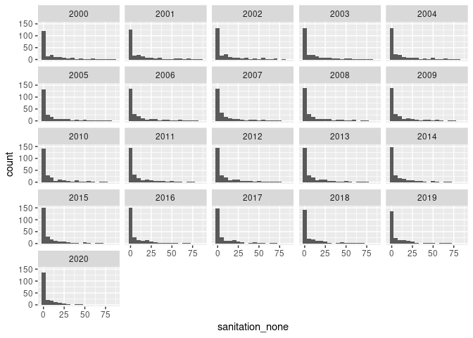
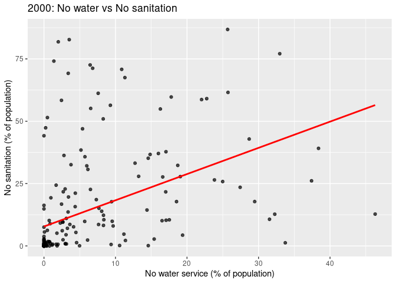
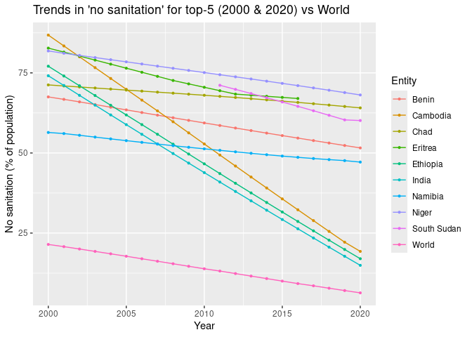

HW 02 - Water and Sanitation - Answer Key
================
Tasneem Arabi
09/24/25

## Load packages and data

``` r
library(tidyverse)
wat_san <- read_csv("data/water-and-sanitation.csv")
```

## Exercises

### Exercise 1

``` r
nrow(wat_san)
```

    ## [1] 5118

### Exercise 2

Each row represents a country–year record (an Entity in a given Year)
with the percentages of the population in that country/year at different
water and sanitation service levels.

### Exercise 3

Between 2000 and 2020, the distribution of no sanitation service shifts
left (toward lower percentages) and becomes more concentrated at lower
values—evidence that open defecation generally declined over time,
though some high-value outliers remain.

``` r
ggplot(data = wat_san, mapping = aes(x = sanitation_none)) +
  geom_histogram(binwidth = 5) +
  facet_wrap(~Year)
```

    ## Warning: Removed 140 rows containing non-finite outside the scale range
    ## (`stat_bin()`).

<!-- -->

``` r
wat_san %>% 
  filter(Entity != "World", Year %in% c(2000, 2020)) %>% 
  ggplot(aes(x = sanitation_none)) +
  geom_histogram(binwidth = 5, boundary = 0, closed = "left") +
  facet_wrap(~ Year) +
  labs(x = "No sanitation (% of population)", y = "Count of countries",
       title = "Distribution of 'no sanitation' across countries in 2000 vs 2020")
```

    ## Warning: Removed 31 rows containing non-finite outside the scale range
    ## (`stat_bin()`).

<!-- -->

### Exercise 4

Countries with the highest “no sanitation” in 2000 (descending).
Comparing water_none and sanitation_none, lack of sanitation tends to be
higher than lack of water, but there’s a clear positive relationship
(countries doing poorly on sanitation also tend to do poorly on water).

``` r
wat_san %>% 
  filter(Year == 2000, Entity != "World") %>% 
  arrange(desc(sanitation_none)) %>% 
  select(Entity, sanitation_none, water_none) %>% 
  slice_head(n = 10)
```

    ## # A tibble: 10 × 3
    ##    Entity                sanitation_none water_none
    ##    <chr>                           <dbl>      <dbl>
    ##  1 Cambodia                         86.8      25.7 
    ##  2 Eritrea                          82.7       3.53
    ##  3 Niger                            81.8       2.00
    ##  4 Ethiopia                         77.1      33.0 
    ##  5 India                            74.1       1.38
    ##  6 Burkina Faso                     72.6       6.46
    ##  7 Chad                             71.2       6.80
    ##  8 Sao Tome and Principe            70.8      10.9 
    ##  9 Nepal                            69.2       3.40
    ## 10 Benin                            67.5      11.3

### Exercise 5

The scatter shows a strong positive association between water_none and
sanitation_none in 2000 (countries with higher lack of water also tend
to have higher lack of sanitation).

``` r
wat_san %>% 
  filter(Year == 2000, Entity != "World") %>% 
  ggplot(aes(x = water_none, y = sanitation_none)) +
  geom_point(alpha = 0.7) +
  geom_smooth(method = "lm", se = FALSE, color = "red") +
  labs(x = "No water service (% of population)", 
       y = "No sanitation (% of population)",
       title = "2000: No water vs No sanitation")
```

    ## `geom_smooth()` using formula = 'y ~ x'

    ## Warning: Removed 22 rows containing non-finite outside the scale range
    ## (`stat_smooth()`).

    ## Warning: Removed 22 rows containing missing values or values outside the scale range
    ## (`geom_point()`).

<!-- -->

### Exercise 6

Top “no sanitation” countries in 2020. Many countries improve and the
very top list changes—some countries drop out, others enter—indicating
progress and/or different rates of change.

``` r
wat_san %>% 
  filter(Year == 2020, Entity != "World") %>% 
  arrange(desc(sanitation_none)) %>% 
  select(Entity, sanitation_none, water_none) %>% 
  slice_head(n = 10)
```

    ## # A tibble: 10 × 3
    ##    Entity                sanitation_none water_none
    ##    <chr>                           <dbl>      <dbl>
    ##  1 Niger                            68.1      4.41 
    ##  2 Chad                             64.1      7.51 
    ##  3 South Sudan                      60.1      8.08 
    ##  4 Benin                            51.6      3.30 
    ##  5 Namibia                          47.2      4.90 
    ##  6 Togo                             45.2     11.2  
    ##  7 Solomon Islands                  44.8      5.64 
    ##  8 Sao Tome and Principe            42.6      1.09 
    ##  9 Madagascar                       42.4     11.6  
    ## 10 Burkina Faso                     39.9      0.354

### Exercise 7

Summary statistics for the top 5 “no sanitation” countries in 2000 and
2020. The 2020 group shows lower central tendency and spread versus 2000
(progress). Sanitation levels are consistently worse than water levels,
though both improve.

``` r
# top-5 per year based on sanitation_none
top5_2000 <- wat_san %>% 
  filter(Year == 2000, Entity != "World") %>% 
  slice_max(sanitation_none, n = 5, with_ties = TRUE)

top5_2020 <- wat_san %>% 
  filter(Year == 2020, Entity != "World") %>% 
  slice_max(sanitation_none, n = 5, with_ties = TRUE)

bind_rows(top5_2000, top5_2020) %>% 
  group_by(Year) %>% 
  summarize(
    water_none_min    = min(water_none, na.rm = TRUE),
    water_none_mean   = mean(water_none, na.rm = TRUE),
    water_none_median = median(water_none, na.rm = TRUE),
    water_none_stdev  = sd(water_none, na.rm = TRUE),
    water_none_iqr    = IQR(water_none, na.rm = TRUE),
    water_none_max    = max(water_none, na.rm = TRUE),
    
    sanitation_none_min    = min(sanitation_none, na.rm = TRUE),
    sanitation_none_mean   = mean(sanitation_none, na.rm = TRUE),
    sanitation_none_median = median(sanitation_none, na.rm = TRUE),
    sanitation_none_stdev  = sd(sanitation_none, na.rm = TRUE),
    sanitation_none_iqr    = IQR(sanitation_none, na.rm = TRUE),
    sanitation_none_max    = max(sanitation_none, na.rm = TRUE)
  )  
```

    ## # A tibble: 2 × 13
    ##    Year water_none_min water_none_mean water_none_median water_none_stdev
    ##   <dbl>          <dbl>           <dbl>             <dbl>            <dbl>
    ## 1  2000           1.38           13.1               3.53            15.0 
    ## 2  2020           3.30            5.64              4.90             2.06
    ## # ℹ 8 more variables: water_none_iqr <dbl>, water_none_max <dbl>,
    ## #   sanitation_none_min <dbl>, sanitation_none_mean <dbl>,
    ## #   sanitation_none_median <dbl>, sanitation_none_stdev <dbl>,
    ## #   sanitation_none_iqr <dbl>, sanitation_none_max <dbl>

### Exercise 8

Time series for World and the union of top-5 countries from 2000 and
2020. Most show declining “no sanitation” rates over time; “World”
declines steadily, and several countries show faster-than-global
improvement.

``` r
# compute set of countries to plot
countries <- bind_rows(top5_2000, top5_2020) %>% 
  pull(Entity) %>% 
  unique()

wat_san %>% 
  filter(Entity %in% c("World", countries)) %>% 
  ggplot(aes(x = Year, y = sanitation_none, color = Entity)) +
  geom_line() +
  geom_point(size = 0.8) +
  labs(y = "No sanitation (% of population)",
       title = "Trends in 'no sanitation' for top-5 (2000 & 2020) vs World")
```

<!-- -->
