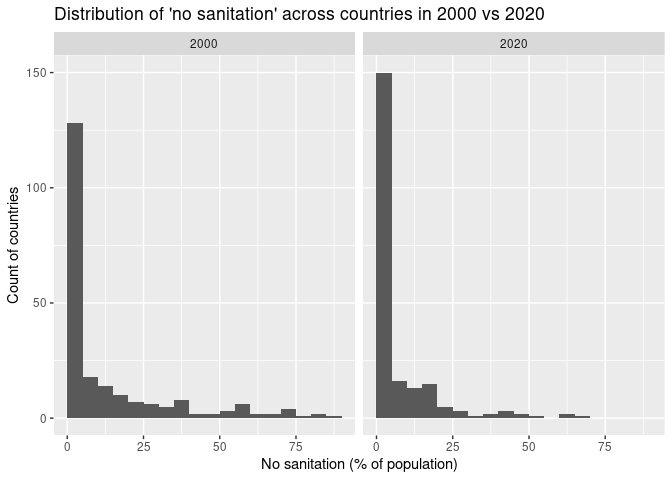

HW 02 - Water and Sanitation - Answer Key
================
Tasneem Arabi
09/24/25

## Load packages and data

``` r
library(tidyverse)
wat_san <- read_csv("data/water-and-sanitation.csv")
```

## Exercises

### Exercise 1

The dataset has r nrow(wat_san) observations (rows).

### Exercise 2

Each row represents a country–year record (an Entity in a given Year)
with the percentages of the population in that country/year at different
water and sanitation service levels.

### Exercise 3

Between 2000 and 2020, the distribution of no sanitation service shifts
left (toward lower percentages) and becomes more concentrated at lower
values—evidence that open defecation generally declined over time,
though some high-value outliers remain.

``` r
wat_san %>% 
  filter(Entity != "World", Year %in% c(2000, 2020)) %>% 
  ggplot(aes(x = sanitation_none)) +
  geom_histogram(binwidth = 5, boundary = 0, closed = "left") +
  facet_wrap(~ Year) +
  labs(x = "No sanitation (% of population)", y = "Count of countries",
       title = "Distribution of 'no sanitation' across countries in 2000 vs 2020")
```

    ## Warning: Removed 31 rows containing non-finite outside the scale range
    ## (`stat_bin()`).

<!-- -->

### Exercise 4

Countries with the highest “no sanitation” in 2000 (descending).
Comparing water_none and sanitation_none, lack of sanitation tends to be
higher than lack of water, but there’s a clear positive relationship
(countries doing poorly on sanitation also tend to do poorly on water).

``` r
wat_san %>% 
  filter(Year == 2000, Entity != "World") %>% 
  arrange(desc(sanitation_none)) %>% 
  select(Entity, sanitation_none, water_none) %>% 
  slice_head(n = 10)
```

    ## # A tibble: 10 × 3
    ##    Entity                sanitation_none water_none
    ##    <chr>                           <dbl>      <dbl>
    ##  1 Cambodia                         86.8      25.7 
    ##  2 Eritrea                          82.7       3.53
    ##  3 Niger                            81.8       2.00
    ##  4 Ethiopia                         77.1      33.0 
    ##  5 India                            74.1       1.38
    ##  6 Burkina Faso                     72.6       6.46
    ##  7 Chad                             71.2       6.80
    ##  8 Sao Tome and Principe            70.8      10.9 
    ##  9 Nepal                            69.2       3.40
    ## 10 Benin                            67.5      11.3

### Exercise 5

Insert your answer here…

### Exercise 6

Insert your answer here…

### Exercise 7

Insert your answer here…

### Exercise 8

Insert your answer here…
