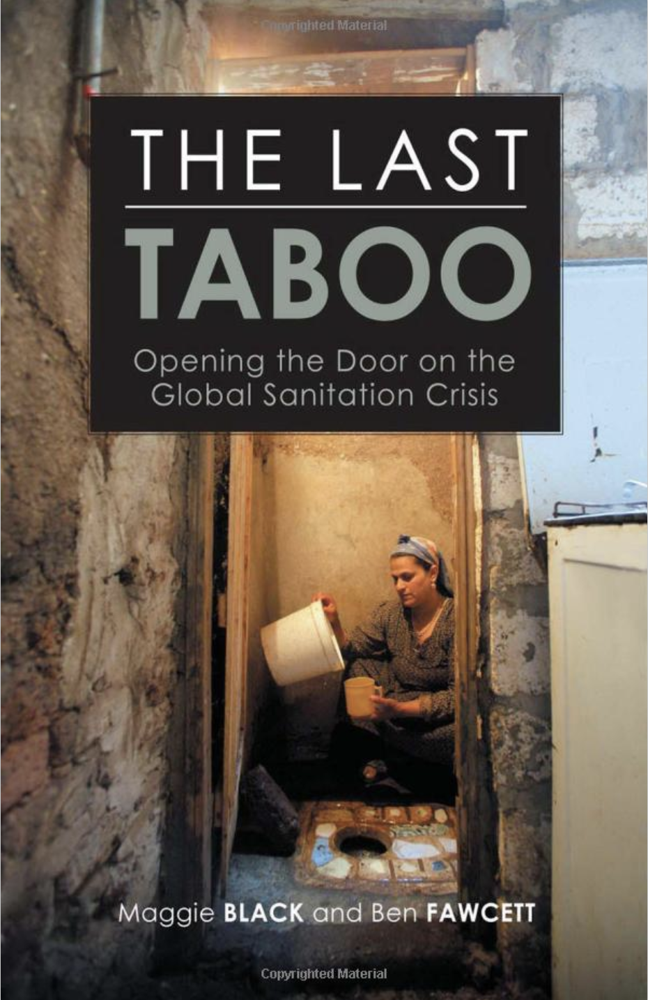

```{r include = FALSE}
knitr::opts_chunk$set(
  eval = FALSE,
  out.width = "80%",
  fig.asp = 0.618,
  fig.width = 6
)
```

```{r photo, fig.margin = TRUE, echo = FALSE, fig.width = 3, fig.cap = "Cover of The Last Tabboo (2008) Black and Fawcett. This book explores the development of sanitation over time and why improvements have lagged behind those in clean water access.", eval = TRUE}

```

The COVID-19 pandemic has exposed our global vulnerability to infectious disease.
Although COVID-19 was unusual in its impact in developed countries, death and sickness from infectious disease is much more common in less developed countries where over 700,000 people globally die each year from preventable infections.

During the pandemic, we were all asked to wash our hands frequently to limit the spread of COVID-19, but clean water and sanitation (toilet facilities) are essential for interventions such as hand washing to be effective.
Using a 2020 datset provided by [Our World in Data](https://ourworldindata.org/water-sanitation-2020-update), we will explore trends over time in clean water and sanitation access around the world.

# Getting Started

Each of your assignments will begin with the following steps.

**NOTE:** If you're reading this in a Knitted output, it probably means you've completed these steps already, in which case, consider this review.

**Steps to generate your own copy of the course materials for each Unit**:

-   Click on the Github repository you want to create your own copy of (e.g., `unit-1`)
-   From the repository landing page, add '/generate' to the end of the url and hit return/enter
-   Skip down to **Owner** and choose `EAES-420-Spring-24`. **Do NOT choose your own account!**
-   Under **Repository Name** enter `unit-X-yourlastname`. 
    - E.g., I would enter `unit-1-mcnicol` for Unit 1.
-   You can ignore the **Description** box.
-   Make sure your own repo is **Private**. It should be private by default.
-   Click **Create Repository** and you will be redirected to your generated repo.

**Steps to copy your generated repo into an RStudioCloud Project and open instructions**:  

-   Copy the URL of the repo you created using the green `Code` button
-   Copy/clone it into a `New Project from a GitHub Repo` in [RStudio Cloud](rstudio.cloud).
-   Navigate to the exercise, lab, or homework folder using the `File` pane.
-   Open the R Markdown instructions `lab-X-instructions.Rmd` or `hw-X-instructions.Rmd` and, Knit.

## Warm up

Before we introduce the data, let's warm up with some simple exercises.

-   Update the YAML, changing the author name to your name, and **knit** the document.
-   Commit your changes with a meaningful commit message.
-   Push your changes to GitHub.
-   Go to your repo on GitHub and confirm that your changes are visible in your Rmd file. If anything is missing, commit and push again.

## Packages and Data

We'll use the **tidyverse** package for much of the data wrangling and visualisation.
This package is already installed for you.
The data can be found in the `/data` folder of the starter repo you've just cloned.
You can load the package and data by running the following in your Console:

```{r load-packages-data, message = FALSE}
library(tidyverse)
wat_san <- read_csv("data/water-and-sanitation.csv")
```

## Viewing Data

You can view the dataset as a spreadsheet using the `View()` function.
Note that you should not put this function in your R Markdown document, but instead type it directly in the Console, as it pops open a new window (and the concept of popping open a window in a static document doesn't really make sense...).
When you run this in the console, you'll see the following **data viewer** window pop up.

```{r view-data}
View(wat_san)
```

**NOTE** Normally you can find out more about the dataset by inspecting its *help* documentation, which you can access by running `?object_name` in the Console or using the Help menu in RStudio to search for `object_name`.  

However, this exercise (and many in this class) use custom dataset for this class, and not integrated into an R package.

More information on this water and sanitation dataset and sanitation access level definitions are available at the [Our World in data](https://ourworldindata.org/sanitation) webpage.

# Exercises

```{marginfigure}
**Hint:** The Markdown Quick Reference sheet has an example of inline R code that might be helpful. You can access it from the Help menu in RStudio.
```

1.  How many observations (rows) does the dataset have?  

- Instead of hard coding the number in your answer, use inline code to add the answer within your narrative response. (Remember, using a single backtick followed by `r` you can create inline code). 

### End of Exercise 1

2.  Run `View(wat_san)` in your Console to view the data in the data viewer. What does each row in the dataset represent?

Provide your exercise responses in the `hw-02.Rmd` starter file.

### End of Exercise 2

🧶 ✅ ⬆️ *Knit,* *commit, and push your changes to GitHub with an appropriate commit message. Make sure to commit and push all changed files so that your Git pane is cleared up afterwards.*

--

Each column represents a variable.
We can get a list of the variables in the data frame using the `names()` function.

```{r}
names(wat_san)
```

As the `?wat_san` function will not work (this dataset is not from an R package), we have provided a variable description list here:

-   `Entity`: Individual country name or `world`
-   `Year`: Year of estimate
-   `water_`: Percent of population with a given level of water access
-   `sanitation_`: Percent of population with a given level of water access

The following variables are suffixes added to either `water_` or `sanitation_` to describe the service level available to people:

-   `_improved`: Improved sanitation access (can be Safely Managed, Basic, or Limited)
-   `_safe`: Best form of improved sanitation (e.g., private toilet)
-   `_basic`: Intermediate form of improved sanitation (e.g., poorly maintained private toilet)
-   `_limited`: Worst form of improved sanitation (e.g., shared toilet)
-   `_unimproved`: Typically a poorly maintained pit latrine
-   `_none`: No sanitation service (open defecation)

3.  Create a faceted histogram where each facet represents a year and displays the distribution of the percent of population with no sanitation access.  

- Does it look like rates of open defecation (no sanitation) have changed between 2000 and 2020?
- What features of the distributions have changed over time, if any?

Copy the code chunk below into the `hw-02.Rmd` starter file and complete it.

### End of Exercise 3

```{r no-sanitation-years, echo = F}
ggplot(data = ___, mapping = aes(x = ___)) +
  geom_histogram(binwidth = ___) +
  facet_wrap(~___)
```

Let's de-construct this code:

-   `ggplot()` is the function we are using to build our plot, in layers.
-   In the first layer we always define the data frame as the first argument. Then, we define the mappings between the variables in the dataset and the **aes**thetics of the plot (e.g. x and y coordinates, colours, etc.).
-   In the next layer we represent the data with **geom**etric shapes, in this case with a histogram. You should decide what makes a reasonable bin width for the histogram by trying out a few options.
-   In the final layer we facet the data by Entity.

🧶 ✅ ⬆️ Knit, *commit, and push your changes to GitHub with an appropriate commit message. Make sure to commit and push all changed files so that your Git pane is cleared up afterwards.*

4.  Use a single code chunk pipeline (`data %>% filter by year %>% arrange in descending order by sanitation_none`) to identity the countries with the highest rates of "no sanitation service" in the year 2000, and arrange these in descending order.  

- Compare the `water_none` and `sanitation_none` columns in the output. 
- Does it appear that water and sanitation infrastructure are well-correlated, or not?

**Hint**: Remember the `slice_max()` function we used in the first week of class!
If not, try `?slice_max()` to check what this function does and what the function **arguments** are.

### End of Exercise 4

5.  Then, in another code chunk pipeline, filter the dataset for the year 2000 and use a scatter plot to visualize the relationship between `water_none` and `sanitation_none`.
- Does this relationship support your previous response about a correlation between the variables, and why?

### End of Exercise 5

6.  In a third code chunk pipeline, identity the countries with the highest rates of "no sanitation service" in the year 2020, and arrange these in descending order.
- Have the countries changed between 2000 and 2020?
- If so, which have been added and which have been lost?

### End of Exercise 6

🧶 ✅ ⬆️ Knit, *commit, and push your changes to GitHub with an appropriate commit message. Make sure to commit and push all changed files so that your Git pane is cleared up afterwards.*

--

The next two exercises are more challenging so we have provided you some code to get you started.  

Copy the code chunk into your `hw-02.Rmd` and try to complete it.  

And don't forget to add your clean text narrative providing your written answers too!

7.  In a final pipeline, calculate the minimum, mean, median, standard deviation, IQR, and maximum rates of `water_none` and `sanitation_none` in the year 2000 and the year 2020 for the 5 countries with the highest amount of "no sanitation service". 

- You'll need to use the function `group_by()` and remember to `filter()` out the `Entity` "World", to remove it.
- What do you notice about the values between 2000 and 2020? 
- What do you notice about the values for sanitation vs. water?

### End of Exercise 7

```{r progress-summary, echo = F}
wat_san %>% 
  filter(Year == ___ & Entity != "World" | Year == ___ & Entity != "World") %>% 
  # this line uses a combination of logical operators (== (equal to), & (and), != (is not equal to), | (or))
  # this combination filters for the two years provided, while excluding any data associated with the "World" Entity
  group_by(Year) %>% 
  # this line groups all the data by Year, so that any summary statistics specified below are computed for each group
  summarize(water_none_min = min(water_none, na.rm = T),
            water_none_mean = mean(___, na.rm = T),
            water_none_median = ___(___, na.rm = T),
            water_none_stdev = sd(___, na.rm = ___),
            water_none_iqr = IQR(___, na.rm = ___),
            water_none_max = ___(___, na.rm = ___),
            
            sanitation_none_min = min(sanitation_none, na.rm = T),
            sanitation_none_mean = mean(sanitation_none, na.rm = T),
            sanitation_none_median = ___(___, na.rm = T),
            sanitation_none_stdev = sd(___, na.rm = ___),
            sanitation_none_iqr = IQR(___, na.rm = ___),
            sanitation_none_max = ___(___, na.rm = ___)

            )
  
```

🧶 ✅ ⬆️ Knit, *commit, and push your changes to GitHub with an appropriate commit message. Make sure to commit and push all changed files so that your Git pane is cleared up afterwards.*

8.  Create a final **time series** visualization that will help you understand why the five countries () with the highest rates of "no sanitation" changed between 2000 and 2020.  

- Include the entity "World" so that you can compare rates of change between individual countries and the world as a whole. 
- Map the `Entity` variable to an aesthetic so that individual countries can be distinguished. 
- Explore the use of different `geom_` to best visualize these trends. 
- Comment on the rates of change in "no sanitation service" over time in some of the countries.

**Note**: A time-series visualization is a plot that shows how a variable is changing over time (in our case, over multiple years/rows/observations in the dataset).

```{r country-global-changes, echo = F}
wat_san %>% 
  filter(Entity == "World" | Entity == "India" | Entity == "___" | Entity == "___" | Entity == "___") %>% 
  ggplot(aes(x = ___, y = ___, color = ___)) +
  geom_line()
```

### End of Exercise 8

🧶 ✅ ⬆️ Knit, *commit, and push your changes to GitHub with an appropriate commit message. Make sure to commit and push all changed files so that your Git pane is cleared up afterwards and review the Rmd document on GitHub to make sure you're happy with the final state of your work.*
