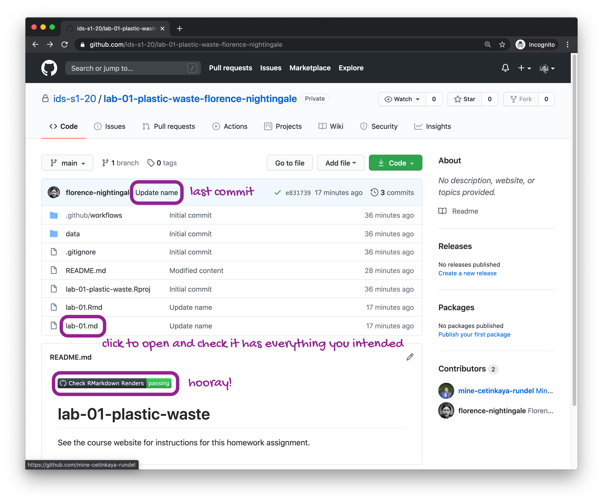

```{r include = FALSE}
knitr::opts_chunk$set(eval = FALSE)
```

Plastic pollution is a major and growing problem, negatively affecting oceans and wildlife health.
[Our World in Data](https://ourworldindata.org/plastic-pollution) has a lot of great data at various levels including globally, per country, and over time.
For this lab we focus on data from 2010.

Additionally, National Geographic ran a data visualization communication contest on plastic waste as seen [here](https://www.nationalgeographic.org/funding-opportunities/innovation-challenges/plastic/dataviz/).

# Learning goals

-   Visualising numerical and categorical data and interpreting visualisations
-   Recreating visualizations
-   Getting more practice using with R, RStudio, Git, and GitHub

# Getting Started

Each of your assignments will begin with the following steps.

**NOTE:** If you're reading this in a Knitted output, it probably means you've completed these steps already, in which case, consider this review.

**Steps to generate your own copy of the course materials for each Unit**:

-   Click on the Github repository you want to create your own copy of (e.g., `unit-1`)
-   From the repository landing page, add '/generate' to the end of the url and hit return/enter
-   Skip down to **Owner** and choose `EAES-420-Spring-24`. **Do NOT choose your own account!**
-   Under **Repository Name** enter `unit-X-yourlastname`. 
    - E.g., I would enter `unit-1-mcnicol` for Unit 1.
-   You can ignore the **Description** box.
-   Make sure your own repo is **Private**. It should be private by default.
-   Click **Create Repository** and you will be redirected to your generated repo.

**Steps to copy your generated repo into an RStudioCloud Project and open instructions**:  

-   Copy the URL of the repo you created using the green `Code` button
-   Copy/clone it into a `New Project from a GitHub Repo` in [RStudio Cloud](rstudio.cloud).
-   Navigate to the exercise, lab, or homework folder using the `File` pane.
-   Open the R Markdown instructions `lab-X-instructions.Rmd` or `hw-X-instructions.Rmd` and, Knit.

## Packages

We'll use the **tidyverse** package for this analysis.
Run the following code in the Console to load this package.

```{r load-packages, message=FALSE, eval=TRUE}
library(tidyverse)
```

## Data

The dataset for this assignment can be found as a csv file in the `data` folder of your repository.  

You can read it in using the following code.

```{r load-data, message=FALSE, eval=TRUE}
plastic_waste <- read_csv("data/plastic-waste.csv")
```

The variable descriptions are as follows:

```{marginfigure}
**Hint:** "Per capita" just means "per person"
```

-   `code`: 3 Letter country code
-   `entity`: Country name
-   `continent`: Continent name
-   `year`: Year
-   `gdp_per_cap`: GDP per capita constant 2011 international \$, rate
-   `plastic_waste_per_cap`: Amount of plastic waste per capita in kg/day
-   `mismanaged_plastic_waste_per_cap`: Amount of mismanaged plastic waste per capita in kg/day
-   `mismanaged_plastic_waste`: Tonnes of mismanaged plastic waste
-   `coastal_pop`: Number of individuals living on/near coast
-   `total_pop`: Total population according to Gapminder

## Warm up

Before we introduce the data, let's warm up with some simple exercises.

-   Update the YAML, changing the author name to your name, and **knit** the document.
-   Commit your changes with a meaningful commit message.
-   Push your changes to GitHub.
-   Go to your repo on GitHub and confirm that your changes are visible in your Rmd file. If anything is missing, commit and push again.

# Navigating RStudioCloud

-   Recall that RStudio is divided into four panes. Without looking, can you name them all and briefly describe their purpose?  

-   Verify that the dataset has loaded into the Environment. How many observations are in the dataset? Clicking on the dataset in the Environment will allow you to inspect it more carefully. Alternatively, you can type `View(plastic_waste)` into the Console to do this.

```{marginfigure}
**Hint:** If you're not sure, run the command `?NA` which will lead you to the documentation.
```

-   Have a quick look at the data and notice that there are cells taking the value `NA` -- what does this mean?

# Exercises

Let's start by taking a look at the *data distribution of plastic waste per capita* in 2010 using `geom_histogram()`.

```{r plastic_waste_per_cap-hist, eval=TRUE}
ggplot(data = plastic_waste, aes(x = plastic_waste_per_cap)) +
  geom_histogram(binwidth = 0.2)
```

One country stands out as an unusual observation at the top of the distribution.  

One way of identifying this country is to filter the data for countries where plastic waste per capita **is greater than 3.5 kg/person.**

```{r plastic_waste_per_cap-max, eval=TRUE}
plastic_waste %>%
  filter(plastic_waste_per_cap > 3.5)
```

Did you expect this result?  

You might consider doing some research on Trinidad and Tobago to see why plastic waste per capita is so high there, or whether this is a data error.

1.  Plot, using **histograms**, the distribution of plastic waste per capita faceted by continent.  

- What can you say about how the continents compare to each other in terms of their plastic waste per capita?

Open your `lab-02.Rmd` starter file and complete the first exercise.  

**Note**: we have provided code chunk labels for you for all eight exercises of this Lab (e.g., `{r chunk-label}`).  

However, when you write new code chunks from scratch, remember to include a code chunk label!

### End of Exercise 1

🧶 ✅ ⬆️ *Now is a good time to knit your document and commit and push your changes to GitHub with an appropriate commit message (e.g., "Completed Exercise 1").*

--

**NOTE:** From this point onwards the plots and the output of the code are not displayed in the Lab instructions, but you should run the code chunks in your RMarkdown file yourself to see the output.  

Then, for the exercises, create new code chunks in your starter file, write the code yourself, and view the output.

Another way of visualizing numerical data is using **density plots**.

```{r plastic_waste_per_cap-dens}
ggplot(data = plastic_waste, aes(x = plastic_waste_per_cap)) +
  geom_density()
```

We can also compare density distributions across continents by colouring density curves by continent.

```{r plastic_waste_per_cap-dens-color}
ggplot(data = plastic_waste, 
       mapping = aes(x = plastic_waste_per_cap, 
                     color = continent)) +
  geom_density()
```

The resulting plot may be a little difficult to read, so let's also fill the curves in with colours as well.

```{r plastic_waste_per_cap-dens-color-fill}
ggplot(data = plastic_waste, 
       mapping = aes(x = plastic_waste_per_cap, 
                     color = continent, 
                     fill = continent)) +
  geom_density()
```

Hmm, still not ideal!  

Overlapping colours make it difficult to tell what's happening with the distributions in continents plotted first, because the later layers are plotted on top of them.  

We can change the transparency level of the fill color to help with this.  

The `alpha` argument takes values between 0 and 1: 0 is completely transparent and 1 is completely opaque.  

There is no way to tell what value will work best, so you just need to try a few.

```{r plastic_waste_per_cap-dens-color-fill-alpha}
ggplot(data = plastic_waste, 
       mapping = aes(x = plastic_waste_per_cap, 
                     color = continent, 
                     fill = continent)) +
  geom_density(alpha = 0.7)
```

This still doesn't look great...

2.  Recreate the density plots above using a different (lower) alpha level that works better for displaying the density curves for all continents.

### End of Exercise 2

3.  Describe why we defined the `color` and `fill` of the curves by mapping aesthetics of the plot but we defined the `alpha` level as a characteristic of the plotting geom.

Again, navigate your `lab-02.Rmd` starter file and complete the second and third exercises.

### End of Exercise 3

🧶 ✅ ⬆️ *Now is a good time to knit your document and commit and push your changes to GitHub with an appropriate commit message.*

--

And yet another way to visualize this relationship is using side-by-side **box plots**.

```{r plastic_waste_per_cap-box}
ggplot(data = plastic_waste, 
       mapping = aes(x = continent, 
                     y = plastic_waste_per_cap)) +
  geom_boxplot()
```

4.  Convert your side-by-side box plots from the previous code chunk to [violin plots](http://ggplot2.tidyverse.org/reference/geom_violin.html).  

- What do the violin plots reveal that box plots do not? 
- What features are apparent in the box plots but not in the violin plots?

Again, navigate your `lab-02.Rmd` starter file and complete the fourth exercise.

### End of Exercise 4

🧶 ✅ ⬆️ *Now is a good time to knit your document and commit and push your changes to GitHub with an appropriate commit message.*

--

```{marginfigure}
**Remember:** We use `geom_point()` to make scatterplots.
```

5.  Visualize the relationship between plastic waste per capita and mismanaged plastic waste per capita using a scatterplot.  
- Describe the relationship.

### End of Exercise 5

Again, navigate your `lab-02.Rmd` starter file and complete the fifth, sixth, and seventh exercise.

6.  Colour the points in the scatterplot by continent.  

- Does there seem to be any clear distinctions between continents with respect to how plastic waste per capita and mismanaged plastic waste per capita are associated?

### End of Exercise 6

7.  Visualize the relationship between plastic waste per capita and total population as well as plastic waste per capita and coastal population.  

- You will need to make two separate plots.
- Do either of these pairs of variables appear to be more strongly linearly associated?

### End of Exercise 7

🧶 ✅ ⬆️ *Now is another good time to knit your document and commit and push your changes to GitHub with an appropriate commit message.*

# Wrapping up

If you still have some time left, move on to the last exercise below.  

If not, complete them after class.  

If you haven't had time to finish the exercises above by end of class on Wednesday, please ask for help on Slack, or go to Martina's office hours!

```{marginfigure}
**Hint:** The x-axis is a calculated variable. One country with plastic waste per capita over 3 kg/day has been filtered out. And the data are not only represented with points on the plot but also a smooth curve. The term "smooth" should help you [pick which geom to use](https://ggplot2.tidyverse.org/reference/index.html#section-geoms).
```

8.  Recreate the following plot in your starter file (copy and paste is fine), and interpret what you see in context of the data.

```{r echo=FALSE, message=FALSE, eval=TRUE, warning=FALSE}
plastic_waste %>% 
  mutate(coastal_pop_prop = coastal_pop / total_pop) %>%
  filter(plastic_waste_per_cap < 3) %>%
  ggplot(aes(x = coastal_pop_prop, y = plastic_waste_per_cap, color = continent)) + 
    geom_point() +
    geom_smooth(color = "black") +
    scale_color_viridis_d() +
    labs(x = "Coastal population proportion (Coastal / total population)", 
         y = "Plastic waste per capita ", 
         color = "Continent",
         title = "Plastic waste vs. coastal population proportion",
         subtitle = "by continent") +
    theme_minimal()
```

### End of Exercise 8

🧶 ✅ ⬆️ Knit, *commit, and push your changes to GitHub with an appropriate commit message. Make sure to commit and push all changed files so that your Git pane is cleared up afterwards and review the .Rmd document on GitHub to make sure you're happy with the final state of your work.*

Once you're done, check to make sure your latest changes are on GitHub! Navigate to the GitHub repo folder that contains this Lab to check this.

```{r echo=FALSE, eval=TRUE}

```
