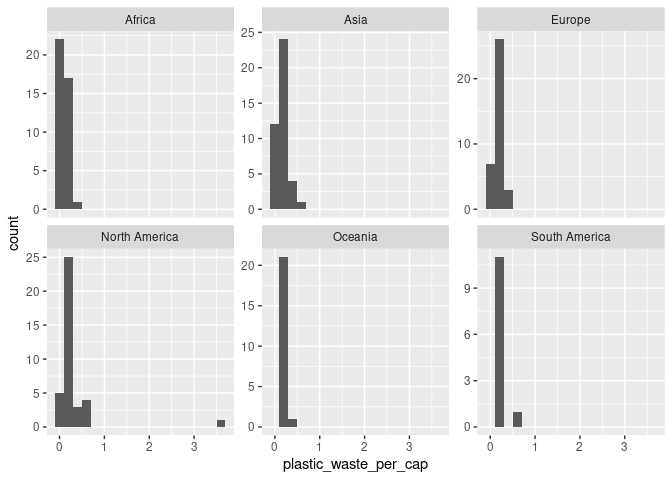
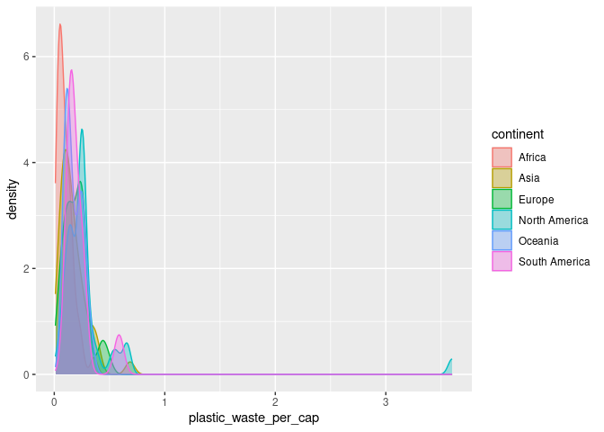
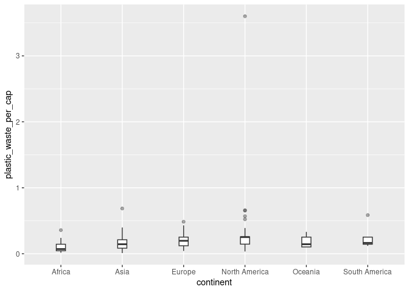
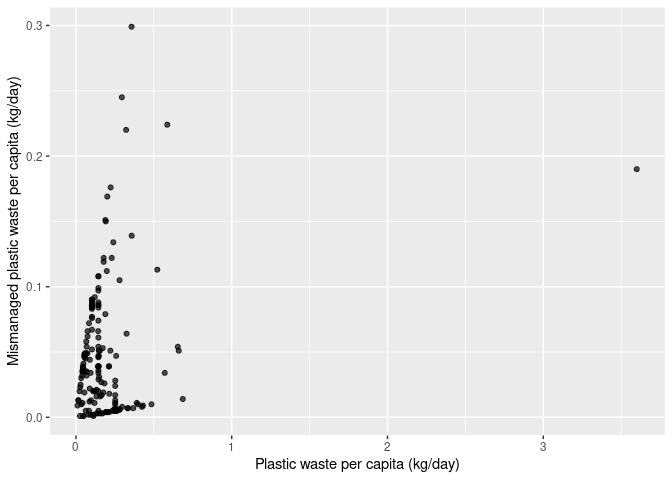
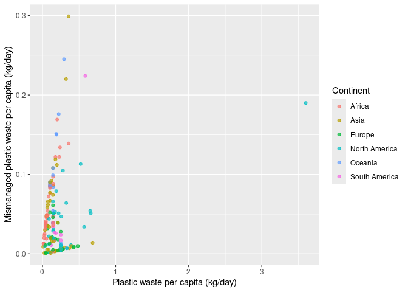
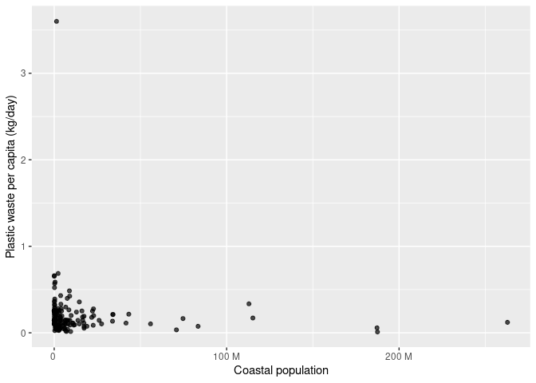
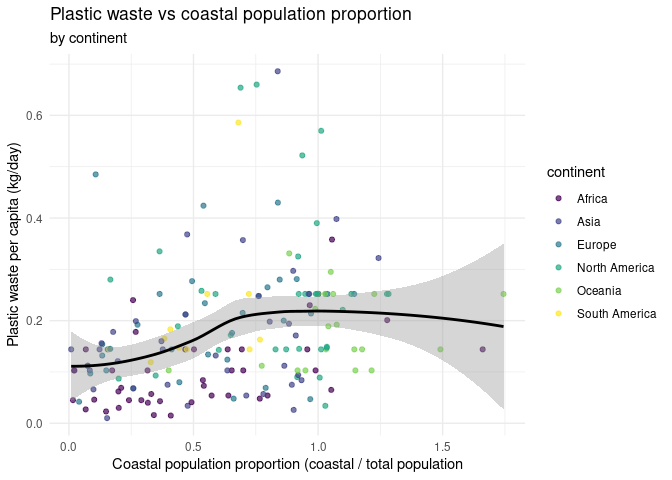

Lab 02 - Plastic waste
================
Tasneem Arabi
09/18/2025

## Load packages and data

``` r
install.packages("tidyverse")
```

    ## Installing package into '/cloud/lib/x86_64-pc-linux-gnu-library/4.5'
    ## (as 'lib' is unspecified)

``` r
library(tidyverse)
```

    ## ── Attaching core tidyverse packages ──────────────────────── tidyverse 2.0.0 ──
    ## ✔ dplyr     1.1.4     ✔ readr     2.1.5
    ## ✔ forcats   1.0.0     ✔ stringr   1.5.2
    ## ✔ ggplot2   4.0.0     ✔ tibble    3.3.0
    ## ✔ lubridate 1.9.4     ✔ tidyr     1.3.1
    ## ✔ purrr     1.1.0

    ## ── Conflicts ────────────────────────────────────────── tidyverse_conflicts() ──
    ## ✖ dplyr::filter() masks stats::filter()
    ## ✖ dplyr::lag()    masks stats::lag()
    ## ℹ Use the conflicted package (<http://conflicted.r-lib.org/>) to force all conflicts to become errors

``` r
plastic_waste <- readr::read_csv("data/plastic-waste.csv")
```

    ## Rows: 240 Columns: 10
    ## ── Column specification ────────────────────────────────────────────────────────
    ## Delimiter: ","
    ## chr (3): code, entity, continent
    ## dbl (7): year, gdp_per_cap, plastic_waste_per_cap, mismanaged_plastic_waste_...
    ## 
    ## ℹ Use `spec()` to retrieve the full column specification for this data.
    ## ℹ Specify the column types or set `show_col_types = FALSE` to quiet this message.

``` r
library(tidyverse) 
```

``` r
plastic_waste <- read_csv("data/plastic-waste.csv")
```

## Exercises

### Exercise 1

These histograms show that across all continents, most countries produce
very little plastic waste per captia, (near zero). The main difference
is is spread: North America and Europe show slightly higher variation,
while Asia, Africa, Oceania, and South America remained tightly group at
the low end.

``` r
ggplot(plastic_waste, aes(x = plastic_waste_per_cap)) +
  geom_histogram(binwidth = 0.2) +
  facet_wrap(~ continent, scales = "free_y")
```

    ## Warning: Removed 51 rows containing non-finite outside the scale range
    ## (`stat_bin()`).

<!-- -->

### Exercise 2

``` r
ggplot(plastic_waste,
       aes(x = plastic_waste_per_cap, color = continent, fill = continent)) +
  geom_density(alpha = 0.35)
```

    ## Warning: Removed 51 rows containing non-finite outside the scale range
    ## (`stat_density()`).

<!-- -->

### Exercise 3

**color** and **fill** are aesthetic mappings because they vary by data
group (which in this case are the continents), so we map them inside
**aes()**. alpha controls how the geometry is drawn, not a data-driven
variable here, so it’s a fixed parameter of the layer and belongs
outside **aes()** inside **geom_density(alpha = …)**.

### Exercise 4

**Violin plots** reveal the full distribution shape (multimodality,
skew, tails). **Box plots** emphasize median and quartiles and show
outliers explicitly. The box is clearer for median/IQR; the violin is
better for seeing bumps and tails.

``` r
ggplot(data = plastic_waste, 
       mapping = aes(x = continent, 
                     y = plastic_waste_per_cap)) +
  geom_boxplot(width = 0.15, outlier.alpha = 0.4)
```

    ## Warning: Removed 51 rows containing non-finite outside the scale range
    ## (`stat_boxplot()`).

<!-- -->

### Exercise 5

There is a clear **positive correlation**: countries generating more
plastic waste per capita tend to mismanage more per perosn, with
dispersion increasing at higher values.

``` r
ggplot(plastic_waste,
       aes(x = plastic_waste_per_cap,
           y = mismanaged_plastic_waste_per_cap)) +
  geom_point(alpha = 0.7) +
  labs(x = "Plastic waste per capita (kg/day)",
       y = "Mismanaged plastic waste per capita (kg/day)")
```

    ## Warning: Removed 51 rows containing missing values or values outside the scale range
    ## (`geom_point()`).

<!-- -->

### Exercise 6

Continents are somewhat seperate; Europe/North America tend to have
**higher waste per capita** but **lower mismanaged share** than
Africa/Asia, which show higher mismanaged values at compaarable waste
levels. Still, there’s overlap showing continent isn’t the only driver.

``` r
ggplot(plastic_waste,
       aes(x = plastic_waste_per_cap,
           y = mismanaged_plastic_waste_per_cap,
           color = continent)) +
  geom_point(alpha = 0.7) +
  labs(x = "Plastic waste per capita (kg/day)",
       y = "Mismanaged plastic waste per cpita (kg/day)",
       color ="Continent")
```

    ## Warning: Removed 51 rows containing missing values or values outside the scale range
    ## (`geom_point()`).

<!-- -->

### Exercise 7

Both relationships look **weak/nonlinear**. Larger populations don’t
necessarily imply higher per capita waste. If anything, coastal
population shows a **slightly stronger**–but still weak–positive trend
than total population.

``` r
ggplot(plastic_waste,
       aes(x = total_pop, y = plastic_waste_per_cap)) +
  geom_point(alpha = 0.7) +
  scale_x_continuous(labels = scales::label_number(scale_cut = scales::cut_si(""))) +
  labs(x = "Total population", 
       y = "Plastic waste per capita (kg/day)")
```

    ## Warning: Removed 61 rows containing missing values or values outside the scale range
    ## (`geom_point()`).

<!-- -->

``` r
ggplot(plastic_waste,
       aes(x = coastal_pop, y = plastic_waste_per_cap)) +
  geom_point(alpha = 0.7) +
  scale_x_continuous(labels = scales::label_number(scale_cut = scales::cut_si(""))) +
  labs(x = "Coastal population", 
       y = "Plastic waste per capita (kg/day)")
```

    ## Warning: Removed 51 rows containing missing values or values outside the scale range
    ## (`geom_point()`).

<!-- -->

### Exercise 8

After filtering out one extreme per capita value, there’s a **slight
upward trend**: countries that have a larger coastal share tend to have
higher per-capita waste, but the relationship is modest and varies by
continent.

``` r
plastic_waste %>%
  mutate(coastal_pop_prop = coastal_pop / total_pop) %>%
  filter(plastic_waste_per_cap < 3) %>%
  ggplot(aes(x = coastal_pop_prop,
             y = plastic_waste_per_cap,
             color = continent)) +
  geom_point() +
  geom_smooth(color = "black") + 
  scale_color_viridis_d() +
  labs(x = "Coastal population proportion (coastal / total population",
       y = "Plastic waste per capita (kg/day)",
       color = "continent",
       title = "Plastic waste vs coastal population proportion",
       subtitle = "by continent") +
  theme_minimal()
```

    ## `geom_smooth()` using method = 'loess' and formula = 'y ~ x'

    ## Warning: Removed 10 rows containing non-finite outside the scale range
    ## (`stat_smooth()`).

    ## Warning: Removed 10 rows containing missing values or values outside the scale range
    ## (`geom_point()`).

<!-- -->
